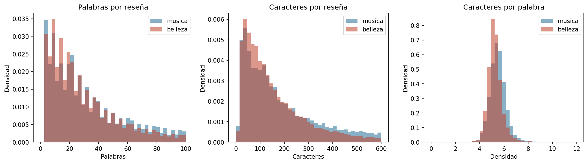
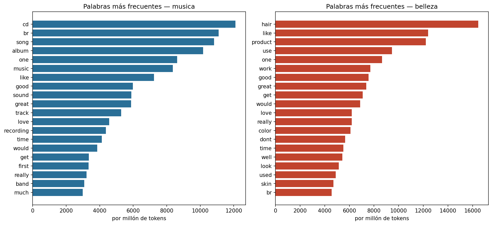
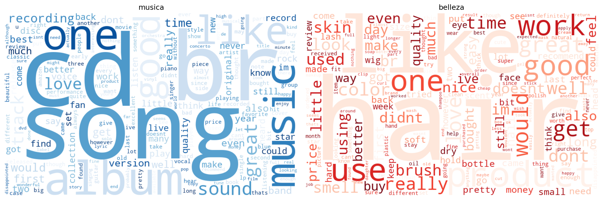
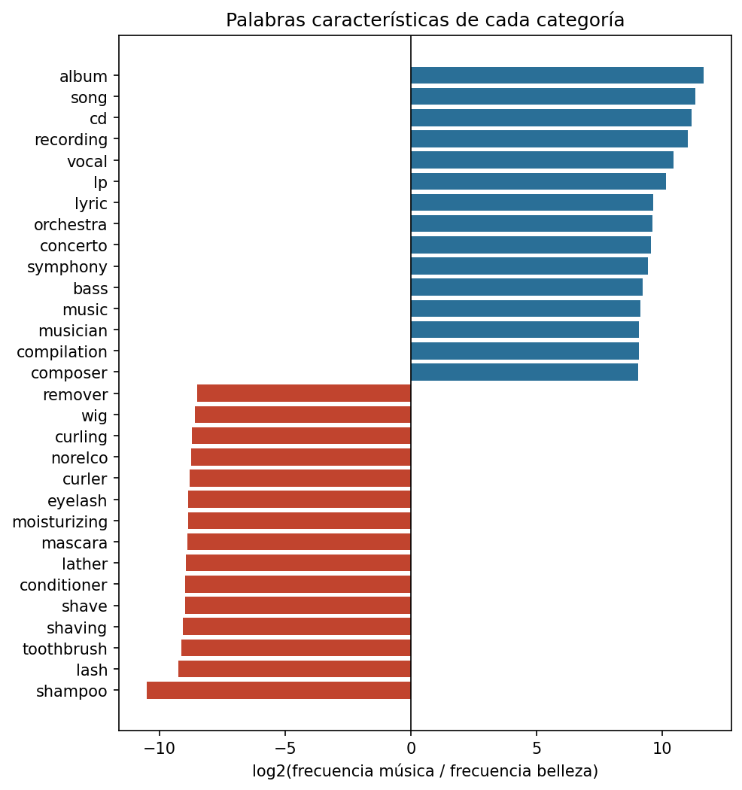
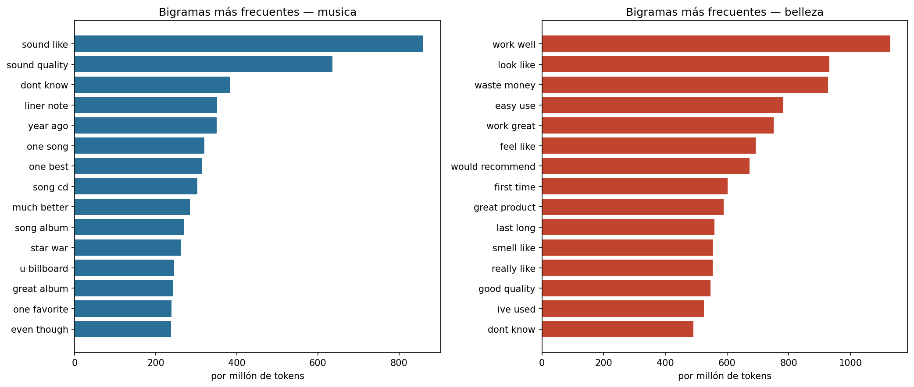
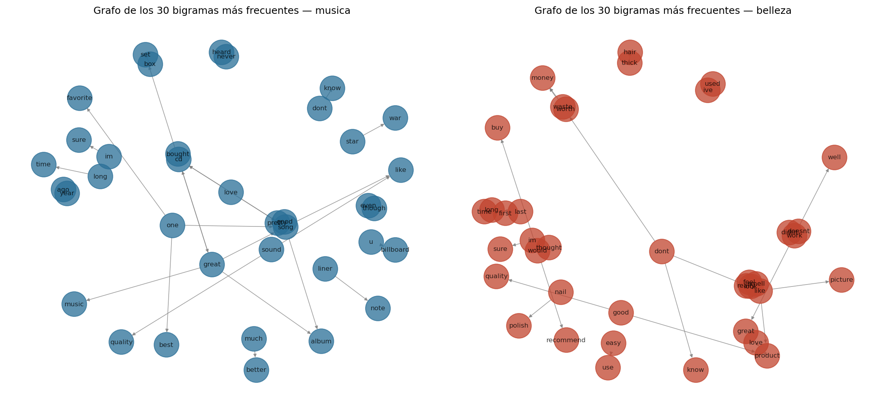
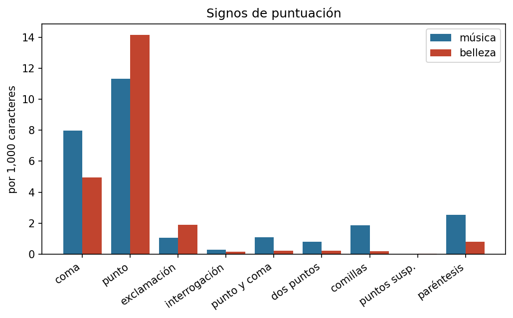
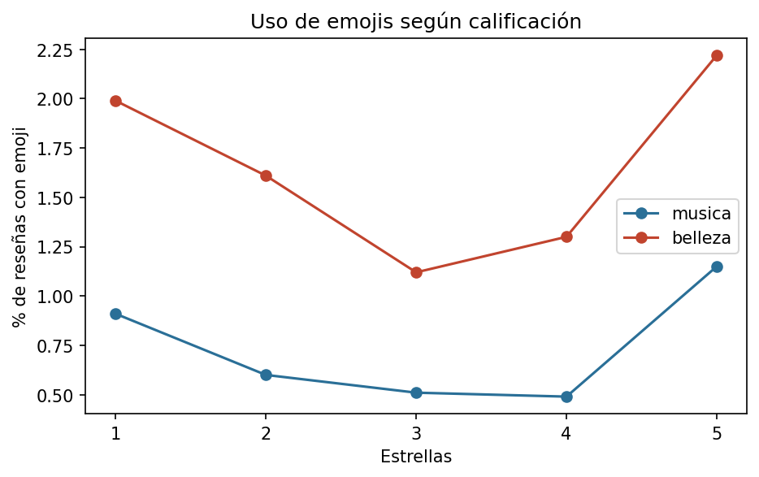

# Tarea 1 — Análisis textual

**Procesamiento y Clasificación de Datos · MCD, FCFM-UANL**

## Pregunta

¿Escribe distinto quien reseña música que quien reseña productos de belleza?

Son dos comunidades de autores en la misma plataforma, con el mismo formato de reseña y el mismo
sistema de estrellas. Si el estilo difiere, difiere por el objeto reseñado.

## Datos

[Amazon Reviews 2023](https://amazon-reviews-2023.github.io/) (McAuley Lab, UCSD). Dos categorías:
`Digital_Music` y `All_Beauty`.

Muestreo estratificado por estrella, sin duplicados de texto, mínimo tres palabras por reseña.

| | Música | Belleza |
|---|---:|---:|
| Reseñas | 34,750 | 50,000 |
| Palabras totales | 2,807,785 | 1,887,032 |
| Tokens tras limpieza | 1,495,134 | 936,284 |
| Palabras distintas | 98,284 | 32,917 |

Belleza alcanzó el tope de 10,000 reseñas en las cinco estrellas; música se quedó corta en 1★, 2★
y 3★ porque hay pocas reseñas negativas de discos. Se documenta el desbalance y se corrige donde
importa: **toda frecuencia se reporta por millón de tokens**, nunca en conteo bruto. Comparar
conteos brutos entre corpus de distinto tamaño produce diferencias que solo reflejan el tamaño.

## Estadística descriptiva

| | Música | Belleza |
|---|---:|---:|
| Palabras por reseña (media) | 80.8 | 37.7 |
| Palabras por reseña (mediana) | 33 | 24 |
| Caracteres por reseña (media) | 461.9 | 198.2 |
| Caracteres por palabra | 5.52 | 5.28 |

Quien reseña música escribe más del doble. Pero la densidad —caracteres por palabra— es casi
idéntica. La diferencia está en **cuánto** escriben, no en qué tan largas son sus palabras.

## Palabras frecuentes

## Palabras que distinguen

Características de **música**: `album`, `song`, `cd`, `recording`, `vocal`, `lp`, `lyric`, `orchestra`

Características de **belleza**: `shampoo`, `lash`, `toothbrush`, `shaving`, `shave`, `conditioner`, `lather`, `mascara`

## Bigramas

## Puntuación

Por cada 1,000 caracteres:

| Signo | Música | Belleza | Razón |
|---|---:|---:|---:|
| coma | 7.988 | 4.948 | 1.61 |
| punto | 11.305 | 14.152 | 0.8 |
| exclamación | 1.055 | 1.897 | 0.56 |
| interrogación | 0.286 | 0.144 | 1.99 |
| punto y coma | 1.09 | 0.211 | 5.17 |
| dos puntos | 0.8 | 0.232 | 3.45 |
| comillas | 1.858 | 0.18 | 10.32 |
| puntos susp. | 0.013 | 0.032 | 0.41 |
| paréntesis | 2.553 | 0.798 | 3.2 |

A diferencia de una transcripción, aquí la puntuación la escribió el propio autor: no hay
intermediario que la introduzca.

## Emojis

| | Reseñas con emoji | Proporción |
|---|---:|---:|
| Música | 265 | 0.76 % |
| Belleza | 824 | 1.65 % |

Belleza usa emojis con más del doble de frecuencia que música.

## Conclusiones

1. **Extensión.** Las reseñas de música son más del doble de largas
   (80.8 contra
   37.7 palabras). La densidad léxica
   es prácticamente igual: escriben más, no más complicado.

2. **Vocabulario.** Música gira en torno a juicios estéticos; belleza, en torno a resultados
   materiales y experiencia de uso del producto.

3. **Emojis.** Belleza los usa al doble. Es coherente con un registro más informal y conversacional.

4. En conjunto, la categoría del producto condiciona **cómo** se escribe la reseña, no solo de qué
   se habla. Un lector humano distinguiría el origen de una reseña sin ver el producto — lo que
   sugiere que un clasificador también podría.

## Limitaciones

- La muestra estratificada no refleja la distribución real de estrellas en Amazon, que está muy
  sesgada hacia 5★. Es deliberado, para las tareas siguientes.
- Música tiene pocas reseñas de 1★–3★ disponibles; su muestra es menor.
- No se verificó la autenticidad de las reseñas; Amazon contiene reseñas incentivadas.
- Todas las reseñas están en inglés.

## Reproducir

1. Correr `comun/descargar_datos.ipynb` (descarga y muestreo).
2. Correr `Tarea1/analisis_textual.ipynb`.

Requiere `pandas`, `numpy`, `matplotlib`, `nltk`, `wordcloud`, `networkx`.

## Referencias

- Hou, Y., Li, J., He, Z., Yan, A., Chen, X., & McAuley, J. (2024). *Bridging Language and Items
  for Retrieval and Recommendation*. arXiv:2403.03952.
- Bird, S., Klein, E., & Loper, E. (2009). *Natural Language Processing with Python*. O'Reilly.
