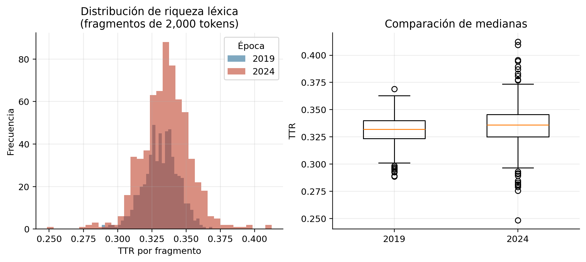
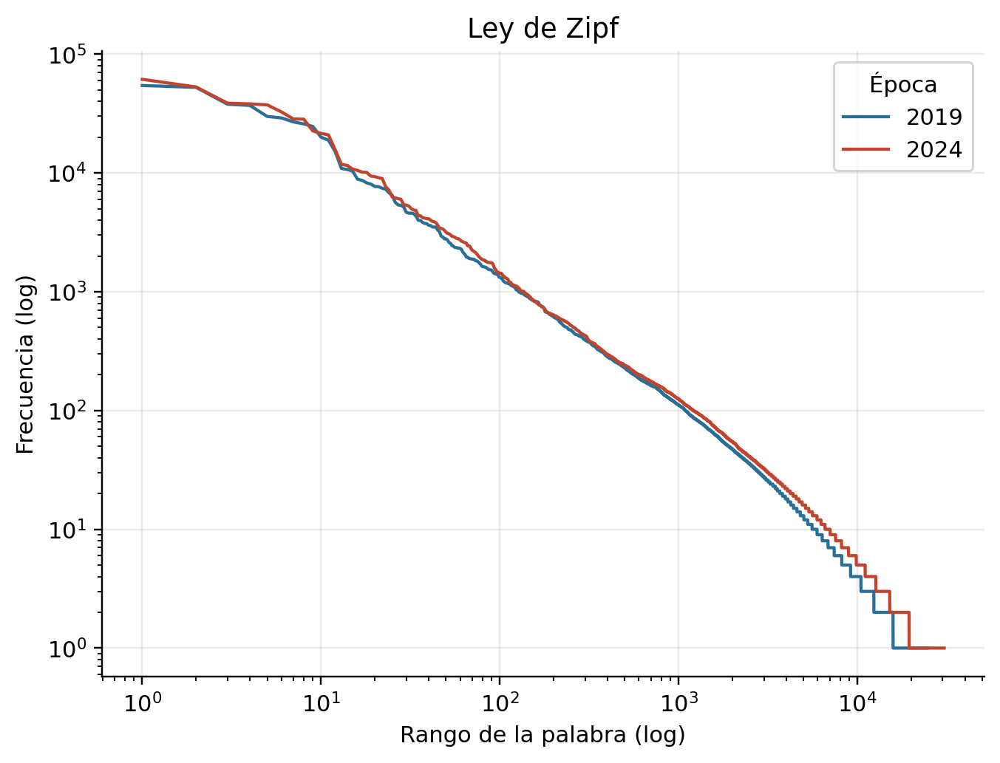
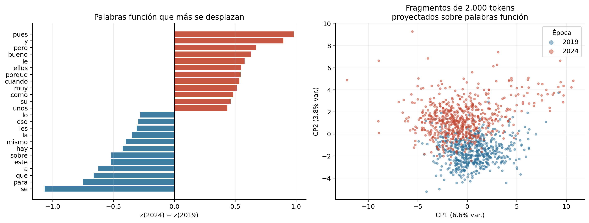
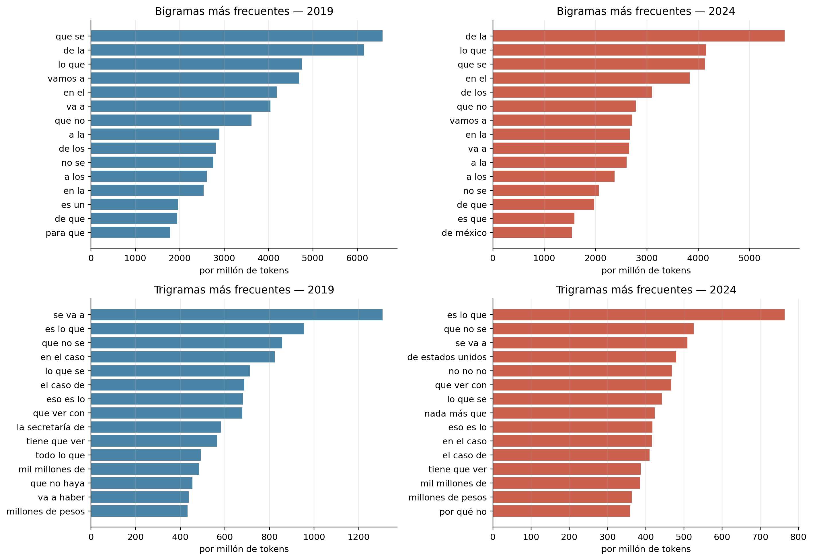
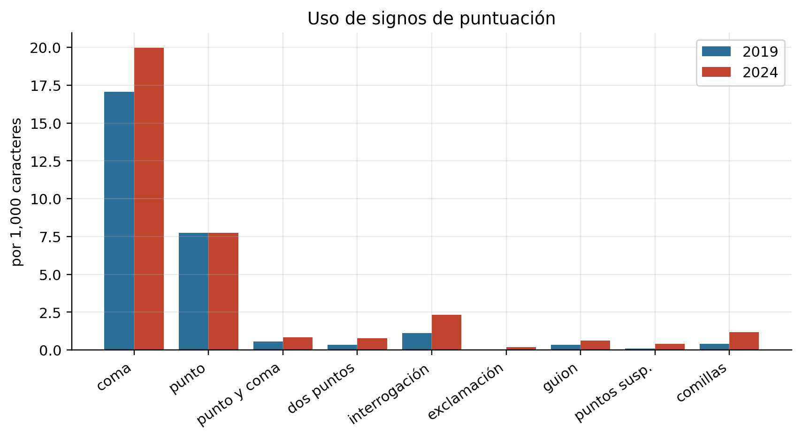
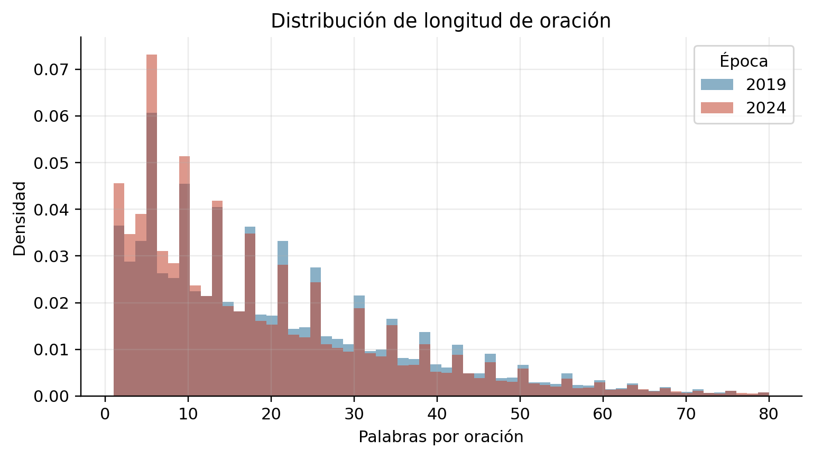

# Análisis estilométrico diacrónico de un corpus de discurso político oral

**Tarea 1 — Análisis textual**
Maestría en Ciencia de Datos · Facultad de Ciencias Físico Matemáticas, UANL
Procesamiento y Clasificación de Datos

---

## Resumen

Se analiza cuantitativamente el estilo de un mismo orador en dos épocas separadas por cinco años, a partir de las versiones estenográficas de las conferencias de prensa matutinas de la presidencia de México (2019 y 2024, *n* = 2,434,315 tokens). Manteniendo constantes el orador y el género discursivo, se aísla la variación diacrónica. Se aplican medidas de riqueza léxica normalizada por longitud, distribuciones de frecuencia, n-gramas, análisis de palabras función y la Delta de Burrows.

Los resultados indican un **desplazamiento estilístico consistente pero de magnitud moderada**: la riqueza léxica aumenta ligeramente (*r* = 0.157), y las palabras función se desplazan desde marcadores de registro expositivo e impersonal (`se`, `para`, `sobre`) hacia conectores de registro oral y narrativo (`pues`, `pero`, `porque`, `bueno`). La Delta de Burrows entre centroides de época es 0.241. Se argumenta que los valores-p obtenidos carecen de valor informativo dado el tamaño del corpus, y que la evidencia sostiene la afirmación de que el estilo *se desplaza* pero no *se transforma*.

---

## 1. Introducción

La estilometría parte de una premisa contraintuitiva: los rasgos que mejor identifican a un autor no son las palabras que elige deliberadamente, sino las que emplea sin advertirlo. Las palabras de contenido —sustantivos, verbos plenos— están determinadas por el tema. Las palabras función —artículos, preposiciones, conjunciones, pronombres— son en cambio aproximadamente independientes del tema y muy estables dentro de un mismo autor. Esa asimetría es lo que permite medir el estilo separándolo del contenido.

Este trabajo aplica ese principio a una pregunta diacrónica: **¿cambia el estilo de un orador a lo largo de seis años de ejercicio público, y en qué dimensiones?**

El caso ofrece condiciones inusualmente favorables. El corpus de las conferencias matutinas presidenciales mexicanas cubre casi seis años ininterrumpidos, con un formato fijo, un mismo orador dominante, periodicidad diaria y transcripción oficial. Es, en efecto, un experimento longitudinal de género controlado.

### 1.1 Diseño

| | Época A | Época B |
|---|---|---|
| Periodo | enero–diciembre 2019 | enero–septiembre 2024 |
| Fase | primer año completo del sexenio | tramo final |
| Género | conferencia de prensa matutina | conferencia de prensa matutina |
| Orador | Andrés Manuel López Obrador | Andrés Manuel López Obrador |

Se descartó deliberadamente el diseño alternativo —comparar discursos de campaña contra conferencias presidenciales— porque confunde dos variables: el cambio de época y el cambio de formato discursivo (monólogo frente a sesión de preguntas). Al restringir ambas muestras al mismo género, la única variable libre es el tiempo.

Este trabajo no formula juicios sobre el contenido político de los discursos. El objeto de estudio es la forma.

---

## 2. Datos

**Fuente.** Repositorio `NOSTRODATA/conferencias_matutinas_amlo`, que compila las versiones estenográficas oficiales publicadas por la Presidencia de la República, organizadas en archivos CSV por conferencia y por participante. Licencia Creative Commons Attribution Share-Alike 4.0.

**Filtrado.** Una conferencia matutina incluye periodistas, funcionarios e invitados. Analizar la transcripción íntegra mediría el habla agregada de decenas de personas. Se retuvieron únicamente las intervenciones atribuidas al orador estudiado.

Este filtrado presenta una dificultad que merece mención. El campo `Participante` contiene **tres grafías distintas** del mismo nombre a lo largo del corpus: la forma canónica, una variante con error tipográfico (`LOPZ OBRADOR`) y una forma abreviada. Un filtro por igualdad exacta habría descartado intervenciones sin emitir advertencia alguna. Se optó por coincidencia de subcadena.

**Limpieza.** Se eliminó un artefacto de transcripción: el separador `":"` que precedía al nombre del hablante en el documento original quedó adherido al inicio de algunas intervenciones. Este artefacto **no se distribuye uniformemente entre épocas** (826 casos en 2019 frente a 308 en 2024), de modo que conservarlo habría introducido una diferencia espuria en el conteo de signos de puntuación.

Ninguna otra transformación se aplicó al texto crudo. En particular, **no** se eliminaron mayúsculas, puntuación ni palabras vacías en esta etapa, por las razones expuestas en §3.1.

**Descriptivos del corpus.**

| | 2019 | 2024 |
|---|---:|---:|
| Conferencias | 248 | 173 |
| Intervenciones del orador | 34,695 | 31,906 |
| Tokens | 1,149,828 | 1,284,487 |
| Tipos (vocabulario) | 24,534 | 30,580 |
| *Hapax legomena* | 8,710 | 11,115 |
| % del vocabulario | 35.5 % | 36.3 % |
| Oraciones | 55,466 | 67,441 |
| **Tokens por conferencia** | **4,636** | **7,425** |

Un primer hecho, previo a cualquier análisis: el orador sostiene **un 30 % menos de conferencias en 2024, pero produce un 12 % más de palabras**. Su participación por evento crece en un 60 %. El corpus se hace más grande al hacerse menos frecuente.

Los dos corpus resultantes son de tamaño comparable (razón 0.89), lo que permite compararlos sin submuestreo.

---

## 3. Metodología

### 3.1 Dos representaciones del texto

Todo tutorial introductorio de procesamiento de lenguaje natural prescribe la misma secuencia: minúsculas, eliminación de puntuación, eliminación de palabras vacías. Para clasificación temática es correcto.

**Para estilometría es un error.** Las palabras vacías y la puntuación *son* la señal. Eliminarlas equivale a borrar el objeto de estudio.

Se derivaron por tanto dos vistas del mismo corpus:

| Vista | Contenido | Usos |
|---|---|---|
| Crudo | texto íntegro, con puntuación y mayúsculas | puntuación, segmentación en oraciones |
| Tokenizado | secuencias alfabéticas en minúscula | frecuencias, n-gramas, riqueza léxica |

### 3.2 Riqueza léxica normalizada

La razón tipo/token (TTR) es el cociente entre el tamaño del vocabulario y el número de tokens. Su defecto es conocido y grave: **decrece monótonamente con la longitud del texto**, porque el vocabulario se satura mientras los tokens continúan acumulándose. Comparar el TTR de dos corpus de distinto tamaño produce conclusiones espurias con independencia total del estilo.

Nótese que en la tabla de §2 el vocabulario de 2024 es mayor (30,580 tipos frente a 24,534). Ese número **no es interpretable** como mayor riqueza léxica: el corpus de 2024 también es más largo.

La corrección adoptada consiste en segmentar cada época en fragmentos de exactamente 2,000 tokens y calcular el TTR de cada fragmento. Al ser de longitud idéntica, sus TTR son directamente comparables. La comparación entre dos escalares se convierte así en una comparación entre dos **distribuciones**, lo que además habilita contraste de hipótesis. Se empleó la U de Mann-Whitney por no asumir normalidad.

### 3.3 Palabras función y Delta de Burrows

Se seleccionaron 113 palabras función con frecuencia conjunta ≥ 200. Sobre la matriz de fragmentos × palabras función, en frecuencia relativa, se calcularon puntuaciones *z* por columna. La Delta de Burrows (Burrows, 2002) entre dos textos es la media de las diferencias absolutas de sus *z*.

La estandarización es lo que hace funcionar la medida. Sin ella, `de` y `la` dominarían por magnitud bruta y ahogarían a las palabras discriminantes. Con ella, cada palabra contribuye en proporción a cuánto se desvía de *su propio* comportamiento típico.

### 3.4 Sobre la significancia estadística

Con corpus del orden de 10⁶ tokens, **cualquier** prueba de hipótesis sobre frecuencias alcanzará significancia. El valor-p mide la capacidad de detectar una diferencia, y con muestras de este tamaño esa capacidad es prácticamente ilimitada: se detectan diferencias arbitrariamente triviales.

Reportar «*p* < 0.001, por lo tanto el hallazgo es significativo» sería, en este contexto, una afirmación vacía: era predecible antes de correr la prueba. Este trabajo reporta los valores-p por transparencia y **fundamenta las conclusiones en tamaños de efecto**.

---

## 4. Resultados

### 4.1 Riqueza léxica



| | 2019 | 2024 |
|---|---:|---:|
| TTR medio (fragmentos de 2,000) | 0.3313 | 0.3354 |
| Desviación estándar | 0.0128 | 0.0177 |

U de Mann-Whitney = 155,396; *p* = 2.35 × 10⁻⁶; **correlación biserial de rangos *r* = +0.157**.

La diferencia es detectable pero pequeña. Un *r* de 0.157 corresponde a distribuciones que se solapan ampliamente. Adicionalmente, la varianza del TTR crece en 2024 (σ pasa de 0.013 a 0.018): el discurso se vuelve no solo levemente más diverso, sino **más heterogéneo entre fragmentos**.

### 4.2 Ley de Zipf



Ajustando sobre el rango 10–1000:

| | Pendiente *a* |
|---|---:|
| 2019 | 1.0786 |
| 2024 | 1.0794 |

Las pendientes coinciden hasta el tercer decimal. Este resultado no es un hallazgo sustantivo sino una **verificación de integridad**: ambos corpus se comportan como lenguaje natural con el mismo exponente, lo que confirma que el proceso de extracción y filtrado no introdujo distorsiones estructurales.

### 4.3 Palabras función



χ²(112) = 7,108.8; *p* ≈ 0; **V de Cramér = 0.0729**.

**Delta de Burrows entre centroides de época = 0.2411.**

Palabras ordenadas por desplazamiento estandarizado *z*(2024) − *z*(2019):

| Característico de 2019 | *z* | Característico de 2024 | *z* |
|---|---:|---|---:|
| `se` | −1.066 | `pues` | +0.980 |
| `para` | −0.751 | `y` | +0.895 |
| `que` | −0.664 | `pero` | +0.670 |
| `a` | −0.626 | `bueno` | +0.627 |
| `este` | −0.522 | `le` | +0.577 |
| `sobre` | −0.520 | `ellos` | +0.545 |
| `hay` | −0.425 | `porque` | +0.543 |
| `mismo` | −0.400 | `cuando` | +0.534 |
| `la` | −0.350 | `muy` | +0.512 |
| `les` | −0.311 | `como` | +0.482 |

El patrón es coherente y admite lectura gramatical directa:

- **2019** concentra el clítico impersonal `se`, las preposiciones `para`, `a`, `sobre`, el existencial `hay` y el determinante `la`. Es la firma de un **registro expositivo e impersonal**: se informa sobre algo, se hace algo, hay tales cifras.
- **2024** concentra los marcadores discursivos `pues` y `bueno`, las conjunciones coordinantes `y` y `pero`, los subordinantes causal `porque` y temporal `cuando`, el pronombre `ellos`, el dativo `le` y el intensificador `muy`. Es la firma de un **registro oral y narrativo**: se cuenta lo que pasó, quién dijo qué, por qué y cuándo.

La proyección de los fragmentos sobre las dos primeras componentes principales muestra solapamiento sustancial con tendencias centrales diferenciadas. La varianza explicada por las dos primeras componentes es baja (6.6 % y 3.8 %), lo que es esperable en matrices de frecuencia de palabras función: la señal está distribuida entre muchas dimensiones y no se concentra en unas pocas.

### 4.4 N-gramas



Los n-gramas más frecuentes reproducen, sin sorpresa, secuencias de palabras función de alta frecuencia. Su valor aquí es de corroboración: no aparece ninguna secuencia anómala que sugiera contaminación del corpus con texto de otros hablantes o con encabezados del documento fuente.

### 4.5 Puntuación y discurso referido



Frecuencias por cada 1,000 caracteres:

| Signo | 2019 | 2024 | Δ | Razón |
|---|---:|---:|---:|---:|
| Punto | 7.749 | 7.731 | −0.018 | **1.00** |
| Coma | 17.054 | 19.976 | +2.922 | 1.17 |
| Punto y coma | 0.573 | 0.836 | +0.263 | 1.46 |
| Dos puntos | 0.332 | 0.790 | +0.458 | 2.38 |
| Interrogación | 1.128 | 2.329 | +1.201 | 2.06 |
| Exclamación | 0.029 | 0.190 | +0.161 | 6.55 |
| Guion | 0.360 | 0.612 | +0.252 | 1.70 |
| Puntos suspensivos | 0.109 | 0.420 | +0.311 | 3.85 |
| Comillas | 0.397 | 1.176 | +0.779 | **2.96** |

Este cuadro exige lectura cuidadosa, y es donde el análisis inicial de este trabajo se corrigió a sí mismo.

La densidad de **puntos permanece esencialmente constante** (razón 1.00), mientras que comillas, dos puntos, signos de interrogación, exclamaciones, guiones y puntos suspensivos aumentan entre un 70 % y un 555 %. Esa combinación específica —comillas, dos puntos, guiones, interrogaciones— es la **notación tipográfica del discurso referido**: el orador de 2024 cita a otras personas, reproduce diálogos y formula preguntas retóricas con frecuencia mucho mayor.

**Consecuencia sobre la longitud de oración.** Una segmentación ingenua en oraciones (cortando en `.`, `!`, `?`, `…`) arroja una mediana de 17 palabras en 2019 frente a 14 en 2024, lo que invitaría a concluir que el orador acortó sus oraciones.



Esa conclusión sería **incorrecta**. La densidad de puntos no cambió; lo que se duplicó fueron los signos de interrogación y se cuadruplicaron los puntos suspensivos, y el segmentador corta en ambos. La aparente reducción de longitud oracional es en buena medida un subproducto del aumento del discurso referido, no una simplificación sintáctica.

Obsérvese además que este hallazgo **converge con el análisis de palabras función**, obtenido por una vía completamente independiente y no sujeta a la mediación del estenógrafo: el ascenso de `ellos`, `le`, `pues`, `bueno`, `porque` y `cuando` es exactamente lo que cabría esperar de un discurso que narra y cita en lugar de exponer. Dos métodos independientes apuntan al mismo fenómeno.

---

## 5. Discusión

Los tres tamaños de efecto obtenidos —*r* = 0.157 para la riqueza léxica, V de Cramér = 0.073 para las palabras función, Delta de Burrows = 0.241— son consistentemente **pequeños**.

La afirmación que la evidencia sostiene es que **el estilo se desplaza, no se transforma**. Los fragmentos de 2019 y 2024 se solapan sustancialmente en el espacio de palabras función; sus centroides difieren, pero un fragmento tomado al azar de una época no sería trivialmente asignable a ella. Sostener que «el orador cambió radicalmente su forma de hablar» excedería lo que los datos permiten.

Lo que sí puede afirmarse con solidez es la **dirección** del desplazamiento, porque dos vías metodológicamente independientes coinciden:

1. Las palabras función migran de marcadores expositivos hacia conectores narrativos y orales.
2. La notación tipográfica del discurso referido se multiplica.

Ambas describen un tránsito desde un registro que *informa* hacia uno que *narra*. Una hipótesis plausible —no verificable con estos datos— es que se trate de una adaptación al formato: seis años de ejercicio diario del mismo género discursivo podrían haber desplazado el estilo desde la lectura de información preparada hacia la conversación espontánea y la anécdota.

El aumento de la varianza del TTR en 2024 apunta en la misma dirección: un discurso más improvisado es un discurso más heterogéneo entre segmentos.

Finalmente, la baja varianza explicada por las dos primeras componentes principales (10.4 % conjunta) sugiere que la señal estilística existe pero es difusa. Para una tarea de clasificación supervisada de épocas —el paso natural siguiente— cabría anticipar un desempeño superior al azar sin llegar a separación limpia, y sería previsiblemente necesario un clasificador que aproveche muchas dimensiones simultáneamente.

---

## 6. Limitaciones

1. **La puntuación es del estenógrafo, no del orador.** El discurso es oral; las comas, comillas y puntos los introduce un transcriptor humano. Un cambio en el equipo o en las convenciones de transcripción entre 2019 y 2024 produciría exactamente el patrón observado en §4.5. Esta limitación es la razón por la cual las conclusiones de este trabajo se anclan en el análisis léxico (§4.3), inmune a esa mediación, y por la cual la convergencia entre ambos análisis es el argumento más fuerte disponible.

2. **Ventanas temporales no equivalentes.** La época B abarca enero–septiembre; carece de los meses finales del año. Si existiese estacionalidad discursiva, no está controlada.

3. **Corpus de terceros no auditado.** No se verificó la fidelidad de las transcripciones contra el audio original. Se descartó la columna `Sentimiento` provista por el repositorio, cuyos propios autores advierten que no es válida.

4. **Composición de la interlocución no controlada.** La proporción entre intervenciones espontáneas y respuestas a preguntas de la prensa pudo variar entre épocas. Dado que el discurso referido aumenta, esta variable podría ser un confusor parcial del hallazgo principal.

5. **El corpus no contiene emoticones.** Por tratarse de transcripción oficial de discurso oral, la categoría de análisis correspondiente no aplica. En su lugar se analizó la notación de discurso referido, que cumple en el registro escrito-de-oral una función paralingüística análoga.

---

## 7. Conclusiones

1. El orador sostiene **menos conferencias pero habla considerablemente más en cada una** (4,636 → 7,425 tokens por evento).

2. La **riqueza léxica normalizada aumenta ligeramente** (TTR 0.3313 → 0.3354; *r* = 0.157) y se vuelve **más variable entre fragmentos** (σ: 0.013 → 0.018).

3. Las **palabras función se desplazan de un registro expositivo e impersonal hacia uno oral y narrativo**. Es el hallazgo más robusto por ser independiente del tema y de las convenciones de transcripción.

4. La **notación del discurso referido se multiplica** —comillas ×2.96, puntos suspensivos ×3.85— mientras la densidad de puntos permanece constante. La aparente reducción de la longitud oracional es un artefacto de este fenómeno, no una simplificación sintáctica.

5. La **Delta de Burrows entre épocas es 0.241**: una diferencia real pero moderada. El estilo se desplaza sin romperse.

6. Ambas líneas de evidencia, metodológicamente independientes, convergen en la misma dirección. Esa convergencia, y no el valor-p, es lo que da fuerza a la conclusión.

---

## Reproducibilidad

```
Tarea1/
├── analisis_textual.ipynb    # análisis completo
├── README.md                 # este reporte
├── figuras/                  # 6 figuras, 220 dpi
└── reporte/
    └── resultados.json       # métricas serializadas
```

El corpus no se versiona (`data/` está en `.gitignore`). Para reproducir:

```bash
cd data
git clone --depth 1 --filter=blob:none --sparse \
    https://github.com/NOSTRODATA/conferencias_matutinas_amlo.git
cd conferencias_matutinas_amlo
git sparse-checkout set 2019 2024
```

Dependencias: `pandas`, `numpy`, `matplotlib`, `scipy`. Semilla fijada en 42. Todas las cifras de este reporte provienen de `reporte/resultados.json`, generado por la última celda del notebook.

---

## Referencias

Burrows, J. (2002). Delta: a measure of stylistic difference and a guide to likely authorship. *Literary and Linguistic Computing*, 17(3), 267–287.

Kestemont, M. (2014). Function words in authorship attribution: from black magic to theory? *Proceedings of the 3rd Workshop on Computational Linguistics for Literature*, 59–66.

NOSTRODATA. *Conferencias matutinas del presidente Andrés Manuel López Obrador.* https://github.com/NOSTRODATA/conferencias_matutinas_amlo (CC BY-SA 4.0).

Zipf, G. K. (1949). *Human Behavior and the Principle of Least Effort*. Addison-Wesley.
