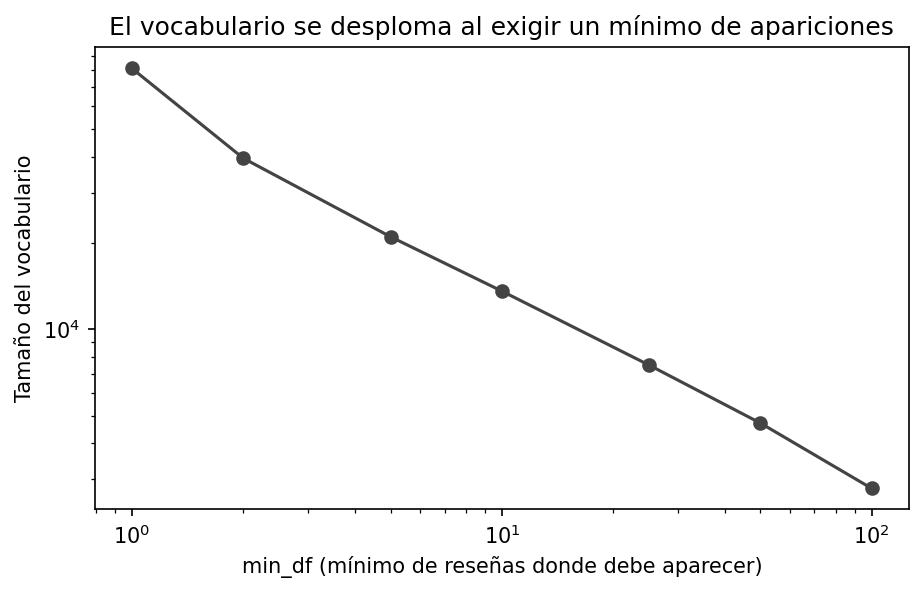
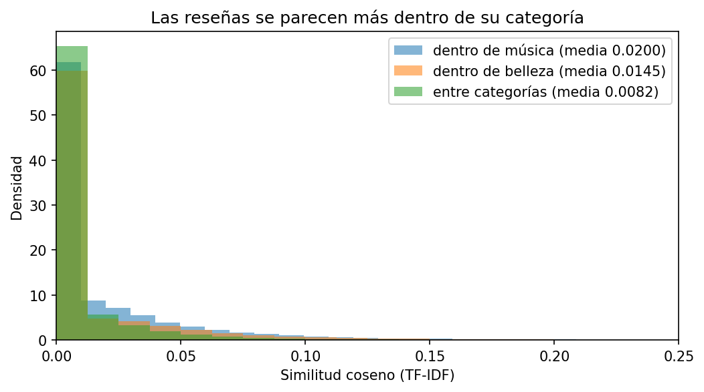
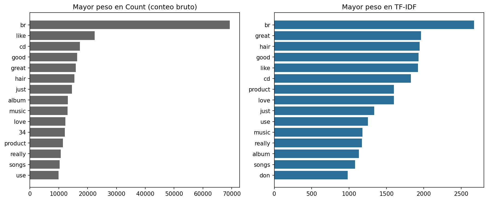
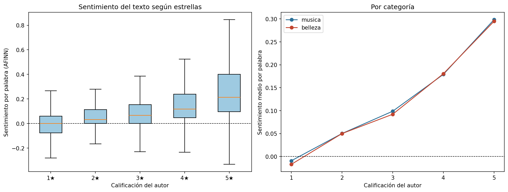

# Tarea 2 — Vectorización y análisis de sentimiento

**Procesamiento y Clasificación de Datos · MCD, FCFM-UANL**

## Objetivo

Convertir las reseñas en vectores, estudiar las propiedades de esa representación, y medir el
sentimiento del texto con un léxico de polaridad comparándolo contra la calificación en estrellas
del propio autor.

## Datos

Los de la Tarea 1: 84,750 reseñas de Amazon (categorías `Digital_Music` y `All_Beauty`),
muestreadas de forma estratificada por estrella. Preparación en `comun/descargar_datos.ipynb`.

## Metodología

**Vectorización.** Bolsa de palabras con `CountVectorizer` y `TfidfVectorizer`
(`min_df=5`, stopwords en inglés). Se estudian dimensión, dispersión, efecto de `min_df` y
estructura de distancias (similitud coseno).

**Sentimiento.** Léxico AFINN: cada palabra tiene polaridad de −5 a +5; el puntaje de una reseña
es la suma. Se normaliza por número de palabras, porque las reseñas de música son el doble de
largas (Tarea 1) y acumularían puntos solo por extensión. La comparación contra estrellas usa
correlación de Spearman, apropiada para una escala ordinal.

## Resultados

### Propiedades de los vectores

| Propiedad | Valor |
|---|---:|
| Reseñas (filas) | 84,750 |
| Vocabulario (columnas, min_df=5) | 21,029 |
| Dispersión | 99.901% de ceros |
| Palabras distintas por reseña (mediana) | 11 |

La matriz es dispersa en extremo: cada reseña enciende ~11
columnas de las 21,029 disponibles. Por eso estas matrices se almacenan en formato
disperso.

El vocabulario se desploma al exigir apariciones mínimas: la mayoría de las palabras son rarísimas
(typos, nombres propios). `min_df=5` reduce el vocabulario a menos de la mitad sin perder
información útil.

### Las distancias miden contenido

| Pares | Similitud media |
|---|---:|
| Dentro de música | 0.0200 |
| Dentro de belleza | 0.0145 |
| Entre categorías | 0.0082 |

Las reseñas se parecen más a las de su propia categoría que a las de la otra. La geometría del
espacio vectorial captura el contenido — condición necesaria para que la clasificación de la
Tarea 3 funcione.

### Sentimiento contra estrellas

El sentimiento del texto **sube monótonamente con las estrellas** en ambas categorías.
Correlación de Spearman global: **ρ = 0.499**.

La mediana de 1★–2★ queda en territorio negativo y la de 4★–5★ en positivo. Un diccionario de
2,500 palabras, sin entender gramática, recupera la señal esencial de la calificación.

### Dónde falla el léxico

- **1,679** reseñas de 1★ con sentimiento por palabra > 0.15
- **218** reseñas de 5★ con sentimiento por palabra < −0.10

Al inspeccionarlas aparecen los límites conocidos del método: negaciones ("not good" suma como
"good"), sarcasmo, comparaciones ("expected better"), y reseñas positivas de contenido triste
(una canción sobre una pérdida). Son errores estructurales de cualquier método de diccionario:
AFINN ve palabras, no oraciones.

## Conclusiones

1. La representación bolsa-de-palabras produce vectores de decenas de miles de dimensiones con
   >99.9% de ceros; `min_df` es la palanca que controla ese tamaño.
2. Las distancias en ese espacio no son ruido: separan categorías de contenido sin que nadie les
   enseñara a hacerlo.
3. Un léxico simple recupera la relación texto–calificación (ρ = 0.499), con fallas
   predecibles en negación y sarcasmo.
4. El sentimiento por diccionario equivale a un producto punto con pesos fijos; la clasificación
   supervisada (Tarea 3) aprenderá esos pesos de los datos, y cabe esperar que supere al
   diccionario precisamente en los casos donde este falla.

## Limitaciones

- AFINN es para inglés y no maneja negaciones, sarcasmo ni contexto.
- La normalización por palabra atenúa, pero no elimina, el efecto de la longitud.
- La muestra estratificada no refleja la distribución real de estrellas de Amazon (deliberado).

## Reproducir

1. `comun/descargar_datos.ipynb` (una vez)
2. `Tarea2/vectorizacion_sentimiento.ipynb`

Requiere `pandas`, `numpy`, `matplotlib`, `scikit-learn`, `afinn`, `scipy`.

## Referencias

- Nielsen, F. Å. (2011). *A new ANEW: evaluation of a word list for sentiment analysis in
  microblogs*. arXiv:1103.2903.
- Hou, Y. et al. (2024). *Bridging Language and Items for Retrieval and Recommendation*.
  arXiv:2403.03952.
