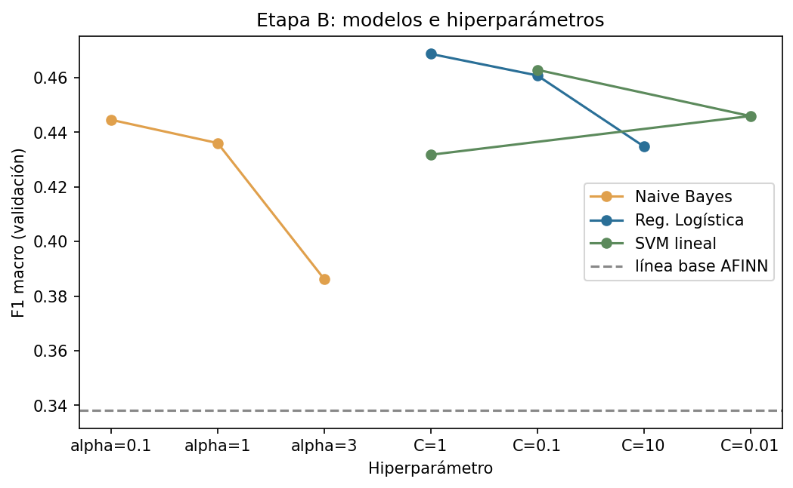
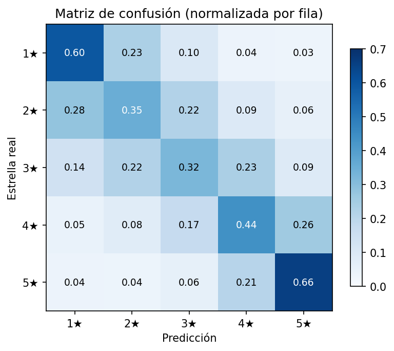
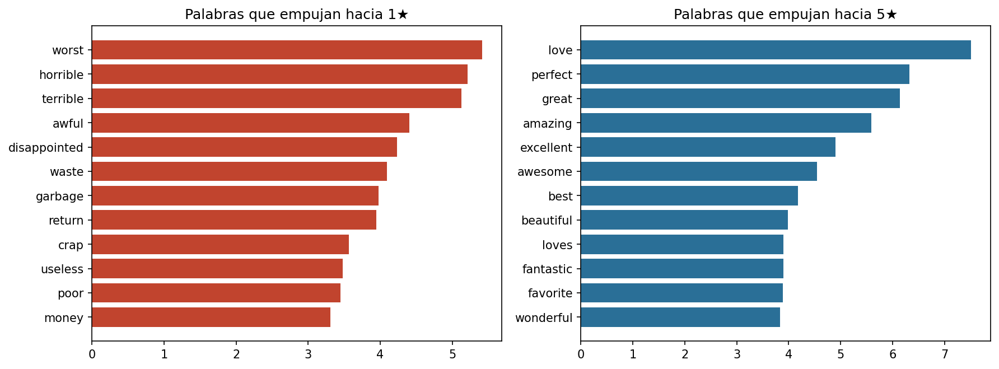

# Tarea 3 — Clasificación de textos: diseño de experimentos

**Procesamiento y Clasificación de Datos · MCD, FCFM-UANL**

## Tarea de predicción

Predecir la calificación (1–5 estrellas) a partir del texto de la reseña. Cinco clases; F1 macro
como métrica principal por el desbalance entre clases. Datos de las tareas anteriores
(84,750 reseñas, dos categorías de Amazon).

Este experimento cierra el arco del curso: en la Tarea 2, el léxico AFINN estimaba sentimiento con
pesos de diccionario. Aquí los pesos **se aprenden de los datos**, y se mide cuánto se gana.

## Diseño

| Factor | Niveles |
|---|---|
| Representación | Count / TF-IDF |
| N-gramas | (1,1) / (1,2) |
| Modelo | Naive Bayes / Reg. Logística / SVM lineal |
| Regularización | 3 niveles por modelo |

**Protocolo.** Partición estratificada 60/20/20 (entrenar/validar/probar). Dos etapas: la Etapa A
compara representaciones con modelo fijo; la Etapa B compara modelos e hiperparámetros sobre la
representación ganadora. Toda decisión se toma en validación; **el conjunto de prueba se usa una
sola vez**, al final. Semilla fija (42).

## Etapa A — Representación

(Modelo fijo: Regresión Logística, class_weight=balanced)

|                   |   F1 macro |   Accuracy |   Columnas |   Segundos |
|:------------------|-----------:|-----------:|-----------:|-----------:|
| TF-IDF, 1-2gramas |   0.468713 |   0.482124 |      40691 |        8.7 |
| TF-IDF, palabras  |   0.456639 |   0.470265 |      15624 |        5.1 |
| Count, palabras   |   0.436609 |   0.451917 |      15624 |       10.2 |
| Count, 1-2gramas  |   0.435155 |   0.449322 |      40691 |       14.5 |

Ganó **TF-IDF, 1-2gramas**. Desglosando la ganancia: pasar de Count a TF-IDF aporta ~0.02 de F1;
añadir bigramas sobre TF-IDF aporta ~0.01 adicional a cambio de ~10× más columnas. La mejora de
los bigramas es real pero modesta — ganaron por poco, y con costo.

## Etapa B — Modelo e hiperparámetros

|                              |   F1 macro |   Accuracy |   Segundos |
|:-----------------------------|-----------:|-----------:|-----------:|
| ('Reg. Logística', 'C=1')    |   0.468713 |   0.482124 |        6.8 |
| ('SVM lineal', 'C=0.1')      |   0.462887 |   0.486372 |        1.8 |
| ('Reg. Logística', 'C=0.1')  |   0.460825 |   0.477994 |        2.4 |
| ('SVM lineal', 'C=0.01')     |   0.445962 |   0.475457 |        0.9 |
| ('Naive Bayes', 'alpha=0.1') |   0.444574 |   0.461475 |        0   |
| ('Naive Bayes', 'alpha=1')   |   0.436051 |   0.471445 |        0   |
| ('Reg. Logística', 'C=10')   |   0.434847 |   0.445723 |       14.1 |
| ('SVM lineal', 'C=1')        |   0.431779 |   0.447788 |        3.4 |
| ('Naive Bayes', 'alpha=3')   |   0.386247 |   0.450914 |        0   |

Ganó **Reg. Logística (C=1)**.

## Resultado final (conjunto de prueba, una sola evaluación)

|                     |   F1 macro |   Accuracy |
|:--------------------|-----------:|-----------:|
| Clase mayoritaria   |      0.076 |      0.236 |
| AFINN (diccionario) |      0.336 |      0.342 |
| Modelo aprendido    |      0.469 |      0.484 |

El modelo aprendido supera a AFINN por **0.133
puntos de F1 macro**: aprender los pesos de los datos gana sobre heredarlos de un diccionario,
usando exactamente la misma familia de funciones (lineal sobre bolsa de palabras).

## Análisis de errores

| Métrica | Valor |
|---|---:|
| Estrella exacta | 48.4% |
| A lo más 1 estrella de error | 83.9% |
| Polaridad correcta (1–2 vs 4–5, sin 3★) | 82.8% |

La confusión se concentra en estrellas **adyacentes** (1↔2, 4↔5). El problema no es distinguir
"me encantó" de "lo odié" — eso está casi resuelto — sino calibrar la intensidad exacta, que es
difícil incluso para el autor de la reseña.

## Pesos aprendidos

Las palabras con mayor peso hacia 1★ y 5★ funcionan como el AFINN que el modelo se construyó a la
medida: incluye vocabulario específico del dominio que ningún diccionario general trae.

## Experimento lateral: clasificar la categoría

Con la misma representación, predecir música vs belleza alcanza
**F1 = 0.957**. El tema es casi perfectamente
separable; la calificación fina no. La dificultad está en la pregunta, no en la representación.

## Conclusiones

1. TF-IDF supera a Count (+0.02 F1); los bigramas añaden una mejora pequeña encima (+0.01) a
   cambio de ~10× más columnas. Ganaron, pero la relación costo-beneficio es discutible.
2. Los tres modelos lineales quedan en un rango estrecho; la regularización mueve más que el
   cambio de familia.
3. Aprender pesos supera al diccionario (0.469 vs
   0.336 de F1 macro) con la misma clase de función.
4. El error restante es de granularidad ordinal, no de polaridad: 84% de las predicciones
   quedan a lo más a una estrella de la verdad.

## Limitaciones

- Muestra estratificada, no representativa de la distribución real de Amazon (deliberado).
- Modelos lineales sobre bolsa de palabras: sin orden, sin negaciones — las mismas cegueras
  estructurales señaladas en la Tarea 2, ahora parcialmente compensadas por pesos aprendidos.
- La escala ordinal se trató como clases nominales; un modelo ordinal explícito es trabajo futuro.

## Reproducir

1. `comun/descargar_datos.ipynb` (una vez)
2. `Tarea3/clasificacion.ipynb`

Requiere `pandas`, `numpy`, `matplotlib`, `scikit-learn`, `afinn`. Semilla 42.

## Referencias

- Pedregosa, F. et al. (2011). *Scikit-learn: Machine Learning in Python*. JMLR 12.
- Nielsen, F. Å. (2011). *A new ANEW*. arXiv:1103.2903.
- Hou, Y. et al. (2024). *Bridging Language and Items for Retrieval and Recommendation*.
  arXiv:2403.03952.
