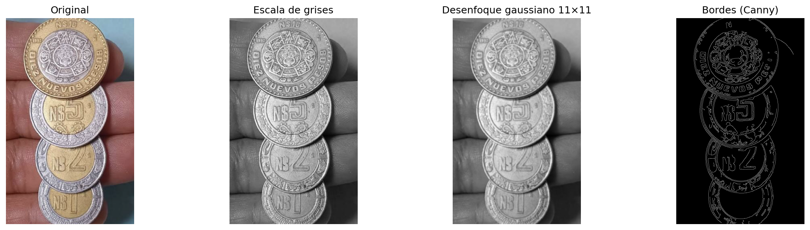
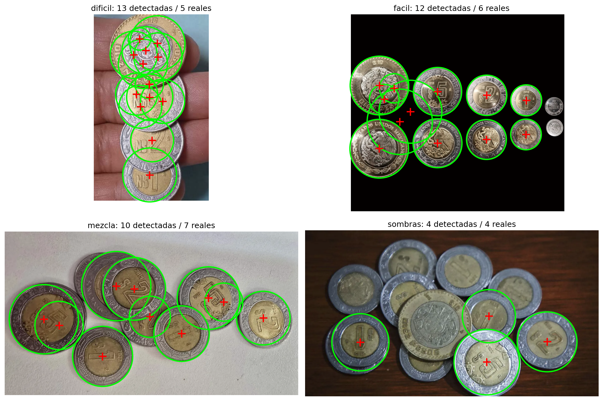
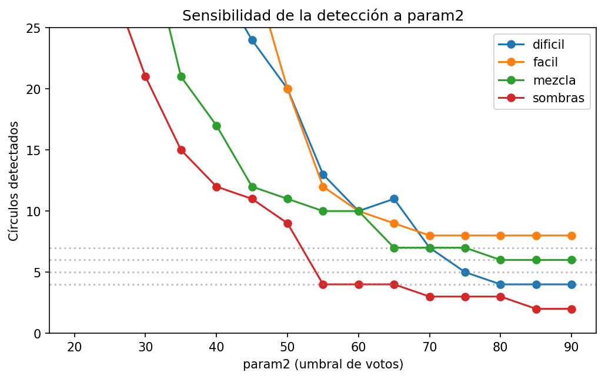

# Tarea 4 — Análisis de imágenes: detección de monedas

**Procesamiento y Clasificación de Datos · MCD, FCFM-UANL**

## Objetivo

Encontrar los centros de objetos circulares (monedas mexicanas) en fotografías propias mediante la
transformada de Hough, y llevar la detección un paso más allá: clasificar la denominación de cada
moneda por su diámetro y contar el dinero de la foto.

## Método

Pipeline de la clase: escala de grises → desenfoque gaussiano (11×11) → `cv2.HoughCircles`
(método gradiente, que aplica Canny internamente).

El desenfoque es indispensable: sin él, el relieve interno de las monedas (águila, números) genera
bordes que Hough interpreta como círculos fantasma.

## Detección

|         |   Detectadas |   Reales |   Diferencia |
|:--------|-------------:|---------:|-------------:|
| dificil |           13 |        5 |            8 |
| facil   |           12 |        6 |            6 |
| mezcla  |           10 |        7 |            3 |
| sombras |            4 |        4 |            0 |

Los centros detectados (cruces rojas) y sus coordenadas completas están en el notebook.

## Experimento: sensibilidad a `param2`

`param2` es el umbral de votos del acumulador de Hough. El barrido de 20 a 90 muestra el
comportamiento típico: valores bajos producen lluvia de círculos falsos; valores altos pierden
monedas reales. La detección correcta vive en una meseta intermedia — y la foto con sombras tiene
la meseta más angosta (o no la tiene), lo que documenta la fragilidad del método ante iluminación
no uniforme.

## Clasificación por diámetro y conteo de dinero

Las monedas mexicanas difieren en diámetro por denominación ($1 = 21 mm, $2 = 23 mm,
$5 = 25.5 mm, $10 = 28 mm). Anclando la escala con la moneda más grande de cada foto, cada radio
detectado se convierte a milímetros y se asigna a la denominación más cercana.

| Foto | Dinero estimado | Dinero real |
|---|---:|---:|
| dificil | $43 | — |
| facil | $38 | — |
| mezcla | $41 | — |
| sombras | $22 | — |

## Hallazgos

1. **El desenfoque gaussiano es el paso que hace posible todo lo demás** — sin él, el relieve de
   las monedas contamina la detección.
2. **`param2` domina el comportamiento**: la diferencia entre detectar bien, detectar fantasmas y
   no detectar nada son ±15 unidades de este parámetro.
3. **Las sombras son el enemigo**: la foto con luz lateral pierde monedas porque la sombra rompe
   el borde circular que Canny necesita.
4. **La clasificación por diámetro funciona** cuando la foto es perpendicular y la referencia de
   escala es correcta; $1 (21 mm) y $2 (23 mm) son las más fáciles de confundir por estar a solo
   2 mm de distancia.

## Limitaciones

- La escala px→mm depende de declarar correctamente la denominación de la moneda mayor.
- Fotos en ángulo convierten círculos en elipses; Hough estándar no las detecta bien.
- Monedas conmemorativas o de $20 no están en el catálogo de diámetros.

## Imágenes utilizadas

Las imágenes provienen de internet (permitido por el enunciado); fuentes:

- `dificil`: URL_AQUI
- `facil`: URL_AQUI
- `mezcla`: URL_AQUI
- `sombras`: URL_AQUI

## Reproducir

Colocar las fotos en `fotos/`, ajustar `REALES` y `REFERENCIA` en la celda de parámetros, y correr
`Tarea4/deteccion_monedas.ipynb`. Requiere `opencv-python`, `numpy`, `pandas`, `matplotlib`.

## Referencias

- Duda, R. O., & Hart, P. E. (1972). *Use of the Hough transformation to detect lines and curves
  in pictures*. Communications of the ACM, 15(1).
- Banco de México. Características de las monedas en circulación.
- OpenCV documentation: `cv2.HoughCircles`.
