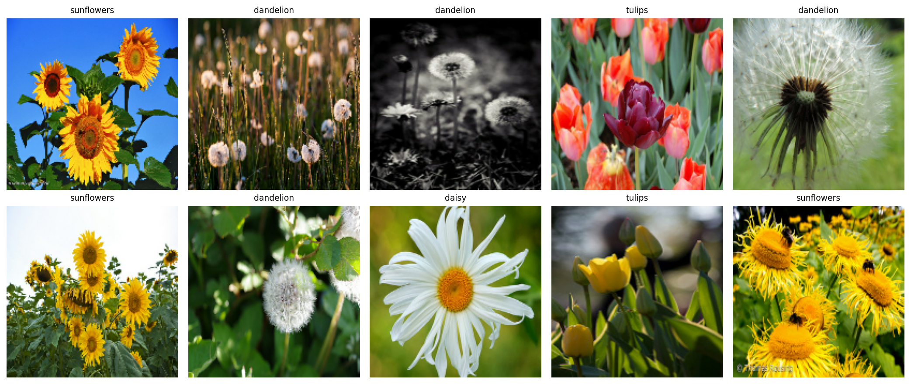
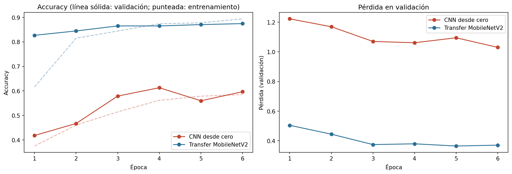
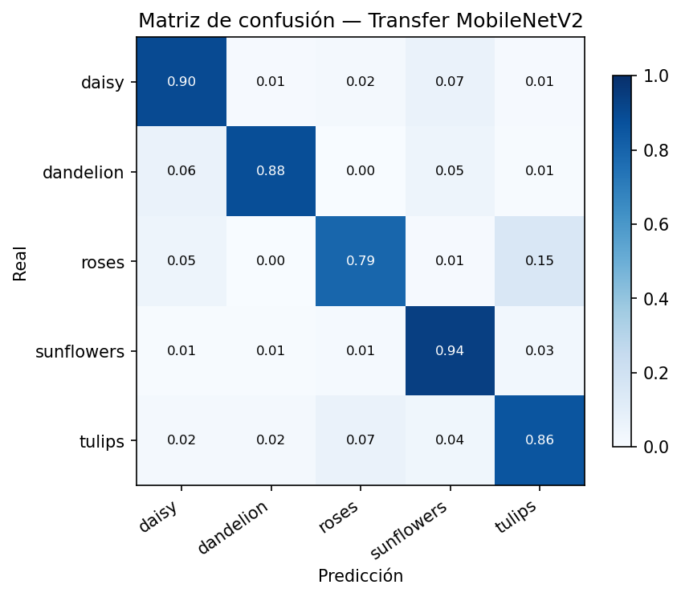
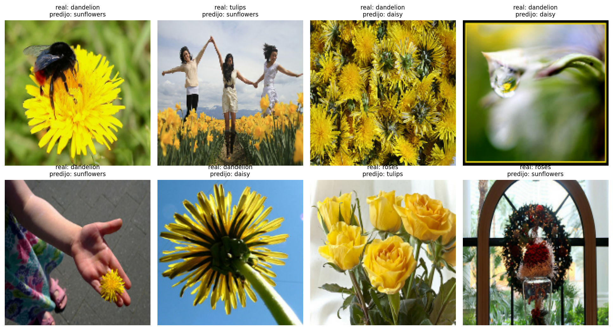

# Tarea 5 — Clasificación de imágenes con CNNs

**Procesamiento y Clasificación de Datos · MCD, FCFM-UANL**

## Objetivo

Comparar, en condiciones idénticas, una CNN entrenada **desde cero** contra **transfer learning**
con MobileNetV2 pre-entrenada en ImageNet, para clasificar fotografías de flores en 5 clases.
La pregunta: ¿cuánto vale heredar pesos cuando hay pocos datos?

## Datos

**tf_flowers**: 3,670 fotografías, 5 clases (daisy, dandelion, roses, sunflowers, tulips), partición 80/20 estratificada
por carpeta, semilla 42.

## Diseño

Mismos datos, mismo aumento (volteo horizontal + rotación ±10%), mismo optimizador (Adam), mismas
6 épocas. Solo cambia el modelo:

| | CNN desde cero | Transfer MobileNetV2 |
|---|---|---|
| Pesos iniciales | aleatorios | ImageNet, congelados |
| Parámetros entrenables | 93,893.0 | 6,405.0 |

## Resultados

| | Val. acc. época 1 | Val. acc. final | Tiempo (s) |
|---|---:|---:|---:|
| CNN desde cero | 0.418 | 0.597 | 49.0 |
| Transfer MobileNetV2 | 0.827 | 0.875 | 65.0 |

Dos observaciones:

1. **La época 1 cuenta la historia**: el transfer learning arranca en 83% — sus filtros
   llegaron sabiendo ver bordes, texturas y formas — mientras la red desde cero arranca en
   42%, cerca del azar (20% con 5 clases).
2. **La brecha final es de 28%**. Con ~600 fotos por clase, la red
   desde cero no tiene datos suficientes para descubrir lo que ImageNet ya le enseñó a la otra.

## Análisis de errores (Transfer MobileNetV2, acc. global 87.5%)

Las confusiones se concentran entre clases visualmente cercanas (rosas y tulipanes comparten
colores y fondos de jardín). Los ejemplos mal clasificados suelen ser fotos con la flor pequeña
en el encuadre, múltiples flores, o ángulos atípicos.

## Conclusiones

1. Con pocos datos, **el transfer learning no es una mejora incremental: es la diferencia entre
   funcionar y no funcionar bien** (87% vs 60% en 6 épocas).
2. El modelo pre-entrenado logra más entrenando **menos parámetros**
   (6,405.0 vs
   93,893.0): lo difícil — ver — ya venía aprendido.
3. El costo computacional es comparable en CPU; MobileNetV2 está diseñada precisamente para eso.

## Limitaciones

- 6 épocas favorecen al pre-entrenado; con muchas más, la CNN desde cero mejoraría, aunque
  con 3,670 fotos su techo probablemente sigue abajo.
- No se hizo *fine-tuning* (descongelar capas superiores de la base); es la extensión natural.
- Una sola semilla; con validación cruzada los números tendrían intervalos.

## Reproducir

Correr `Tarea5/cnn_flores.ipynb`. El dataset (~220 MB) y los pesos de ImageNet (~9 MB) se
descargan automáticamente la primera vez. Requiere `tensorflow`; en Mac con chip Apple,
`tensorflow-metal` acelera con el GPU integrado (opcional).

## Referencias

- Sandler, M. et al. (2018). *MobileNetV2: Inverted Residuals and Linear Bottlenecks*. CVPR.
- Deng, J. et al. (2009). *ImageNet: A Large-Scale Hierarchical Image Database*. CVPR.
- The TensorFlow Team. *Flowers dataset*.
