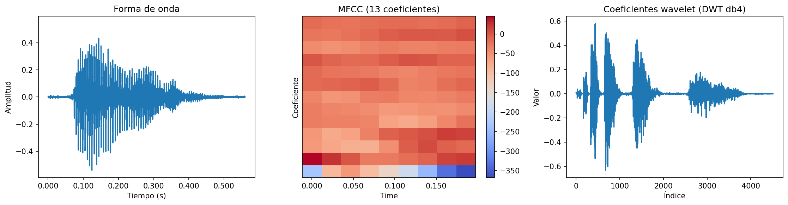
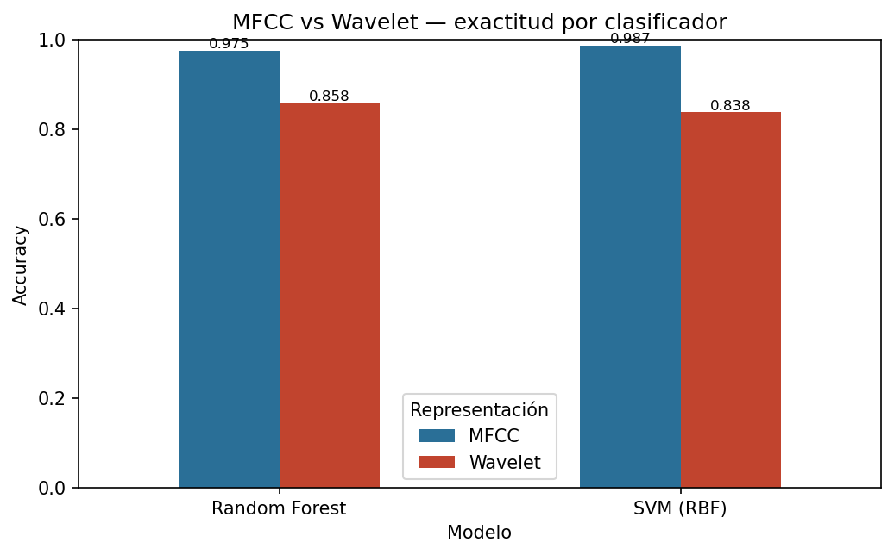
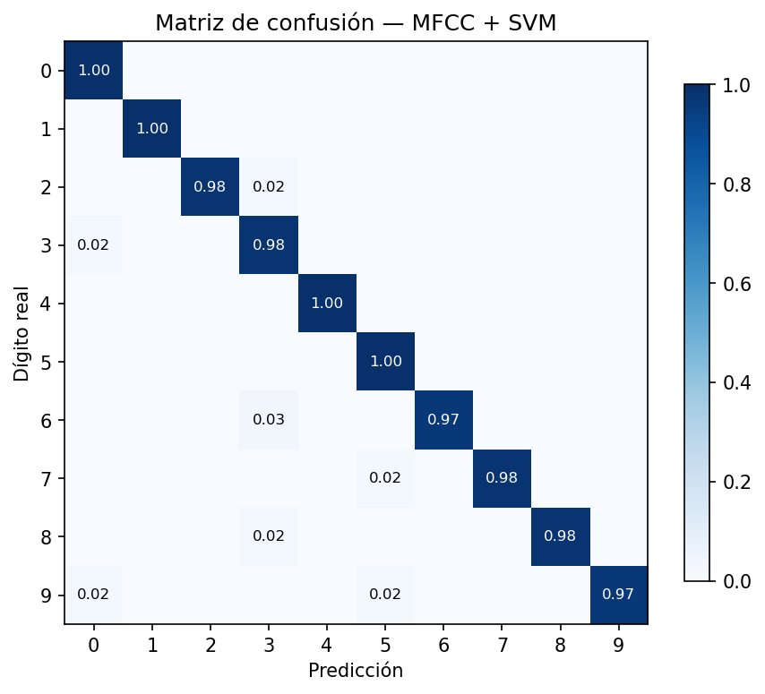

# Tareas 6 y 7 — Procesamiento y clasificación de audio

**Procesamiento y Clasificación de Datos · MCD, FCFM-UANL**

## Objetivo

Clasificar dígitos hablados (0–9) a partir de grabaciones de voz, comparando dos formas de
representar el audio: **MFCC** (coeficientes cepstrales en escala Mel, Clase 7) y **wavelets**
(transformada wavelet discreta, Clase 8). La pregunta: ¿qué representación captura mejor la
identidad de un dígito hablado?

## Datos

**Free Spoken Digit Dataset**: 3,000 grabaciones WAV, dígitos 0–9,
6 hablantes, 8 kHz. Nombre de archivo `{dígito}_{hablante}_{índice}.wav`.
Licencia CC BY 4.0.

## Método

Cada grabación tiene longitud variable (cada persona dice el dígito a su ritmo), así que ambas
representaciones se resumen en **vectores de tamaño fijo** colapsando el eje temporal con
estadísticas:

- **MFCC** (26 dimensiones): media y desviación estándar de 13 coeficientes.
- **Wavelet** (35 dimensiones): media, desviación, energía RMS, máximo y mediana por
  sub-banda de una descomposición DWT (db4, 6 niveles).

Protocolo idéntico para ambas: partición estratificada 80/20, estandarización ajustada solo en
entrenamiento, clasificadores SVM (RBF) y Random Forest. Semilla 42.

## Resultados

| Representación   | Modelo        |   Accuracy |   F1 macro |
|:-----------------|:--------------|-----------:|-----------:|
| MFCC             | SVM (RBF)     |   0.986667 |   0.986745 |
| MFCC             | Random Forest |   0.975    |   0.975074 |
| Wavelet          | SVM (RBF)     |   0.838333 |   0.8389   |
| Wavelet          | Random Forest |   0.858333 |   0.857938 |

**MFCC supera a las wavelets** por un margen amplio (mejor MFCC: 0.987 vs mejor wavelet:
0.858). La razón es de diseño: MFCC fue creado específicamente para voz — la escala Mel
reproduce la sensibilidad no lineal del oído humano a las frecuencias. Las wavelets son una
herramienta general de análisis tiempo-frecuencia, potente pero no sintonizada a la percepción del
habla.

El enunciado destaca las wavelets, y el resultado honesto del experimento es que son una
representación razonable pero subóptima para este problema específico. Identificar la herramienta
correcta para cada tarea es parte del análisis.

## Análisis de errores

Con MFCC + SVM la exactitud es 98.7%. Las confusiones residuales ocurren entre dígitos
fonéticamente cercanos.

## Prueba de generalización a hablante nuevo

El split 80/20 mezcla hablantes: el modelo puede ver a una persona en entrenamiento y ser evaluado
con más grabaciones suyas. La prueba realista es **leave-one-speaker-out**: dejar cada hablante
completamente fuera del entrenamiento por turnos y evaluar solo con su voz.

| Escenario | Exactitud |
|---|---:|
| Hablantes mezclados (80/20 aleatorio) | 98.7% |
| Hablante nuevo (promedio LOSO) | 60.0% |
| Hablante nuevo (rango) | 26% – 77% |

La exactitud **cae fuertemente** con hablantes nuevos, y **varía mucho entre ellos**
(26% a 77%). Esto revela que parte del
98.7% del split mezclado venía de reconocer voces conocidas, no solo dígitos. Es la prueba que de
verdad importa para un sistema real, y la que distingue un experimento honesto de uno optimista.

## Conclusiones

1. **MFCC es la representación adecuada para voz** (0.987 vs 0.858 de exactitud):
   la herramienta diseñada para el dominio gana a la herramienta general.
2. El resumen estadístico de coeficientes convierte señales de longitud variable en vectores fijos
   sin perder la información discriminante.
3. **La generalización a hablantes nuevos (promedio 60%) es mucho menor que el
   split mezclado (99%)** y varía enormemente entre voces: el resultado más importante de
   la tarea, porque es el que refleja el uso real.

## Limitaciones

- El resumen estadístico descarta el orden temporal fino; un modelo secuencial (RNN, o CNN sobre
  el espectrograma) lo aprovecharía.
- Dataset de 6 hablantes: la generalización a acentos muy distintos no está probada.
- Las wavelets podrían mejorar con otra ondícula o esquema de resumen; se usó una configuración
  estándar.

## Reproducir

1. `cd data && git clone --depth 1 https://github.com/Jakobovski/free-spoken-digit-dataset.git`
2. Correr `Tarea6_7/clasificacion_audio.ipynb`.

Requiere `librosa`, `pywavelets`, `scikit-learn`, `numpy`, `matplotlib`.

## Referencias

- Jackson, Z. (2016). *Free Spoken Digit Dataset*. https://github.com/Jakobovski/free-spoken-digit-dataset (CC BY 4.0).
- Davis, S., & Mermelstein, P. (1980). *Comparison of parametric representations for monosyllabic
  word recognition*. IEEE Transactions on Acoustics, Speech, and Signal Processing.
- McFee, B. et al. (2015). *librosa: Audio and music signal analysis in Python*.
